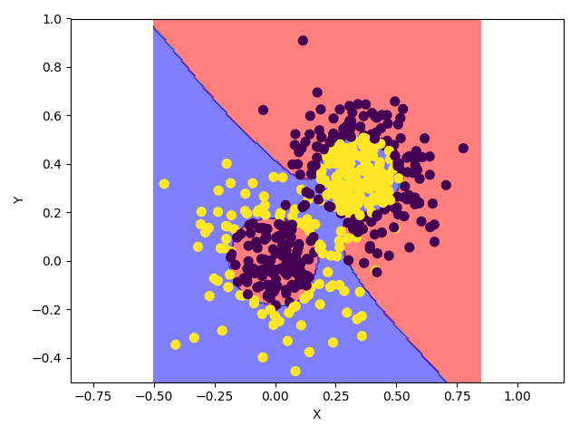
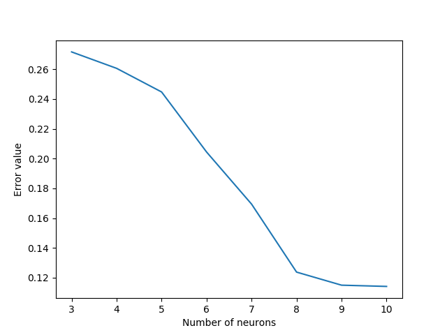

# Искусственные нейросети
## Метод обратного распространения ошибки

Метод вычисления градиента, который используется при обновлении весов многослойного перцептрона. 

Это итеративный градиентный алгоритм, который используется с целью минимизации ошибки работы многослойного перцептрона (MLP) и получения желаемого выхода.

Основная идея метода состоит в распространении сигналов ошибки от выходов сети к её входам, в направлении, обратном прямому распространению сигналов ошибки от выходов сети к её входам, в направлении, обратном прямому распространению сигналов в обычном режиме работы.

Для возможности применения метода обратного распространения ошибки активационная функция должна быть дифференцируема. Метод является модификацией метода градиентного спуска.

Сам базовый ***BackPropagation***  :

1. Инициализировать  маленькими случайными значениями, 
2. Повторить **n_steps** раз:
    -  Для всех **d** от *1* до *m* :
        - Подать   на вход сети и подсчитать выходы  каждого узла.
        - Для всех  **:** 
        - Для каждого уровня **l**, начиная с предпоследнего: 
            - Для каждого узла **j** уровня **l** вычислить 
        - Для каждого ребра сети **{i, j}** : 
 
3. Выдать значения 


где   — коэффициент инерциальности для сглаживания резких скачков при перемещении по поверхности целевой функции

Несмотря на то, что функция уменьшается в направлении антиградиента, это не гарантирует самое быстрое схождение. Для этих целей были разработаны модификации исходного метода - алгоритмы сопряжённого градиента, где поиск происходит вдоль направлений сопряжения, что, в общем случае, приводит к более быстрой сходимости.

В большинстве алгоритмов обучения ранее, темп обучения используется для определения длины обновления весов (размер шага)
В алгоритмах сопряжённого градиента, размер шага изменяется на каждой итерации. В общем случае, суть методов следующая:

 **N** переменных, которую нужно минимизировать.

 - градиент, направление вектора наискорейшего возрастания. Для минимизации, двигаемся в направлении антиградиента: 

 - размер шага, подбирается бинарным поиском: 

На первой итерации движемся в направлении градиента . На следующих итерациях движемся вдоль направлений сопряжения 

На каждой итерации:
1. Рассчитаем направление: 
2. По формуле **Hestenes** и **Stiefel** вычислим : 
3. Обновим направление 
4. Оптимизируем направление (воспользуемся золотым сечением для поиска правой границы в спуске) 
5. обновим позицию 


### Реализация

Датасет был сгенерирован методом из **sklearn** **make_gaussian_quantiles**, который создаёт изотропные гауссовские выборки по квантилям. Датасет для классификации создаётся из многомерного нормального распределения и определения классов, разделённых вложенными концентрическими многомерными сферами так, что количество элементов в каждом классе почти одинаково
```python
    x1, y1 = make_gaussian_quantiles(cov=2.,
                                     n_samples=200, n_features=2,
                                     n_classes=2, random_state=1)
```

Был реализован класс **NeuralNetwork**, содержащий необходимый функционал (методы оригинального **BackProp**) 
Возможно создать нейросеть с любым набором слоёв, количеством нейронов на каждом слое и функцией активации. Например:

```python
net = NeuralNetwork([2, 10, 2], ["sigmoid", "softmax"])
```
Метод прямого прохода по сети

```python
    def forward(self, x):
        # propagate inputs through the network
        self.I = [0]
        self.O = [x]
        ret = x
        for i in range(self.len - 1):
            I = ret.dot(self.W[i]) + self.b[i]
            O = self.f[i](I)
            self.I.append(I)
            self.O.append(O)
            ret = O
        return ret
```
Обратный проход (backward pass)
```python
        # compute dI for last layer
        dI[-1] = (self.O[-1] - y) * self.deriv[-1](self.I[-1]) / T

        # compute dI for previous layers
        for q in range(self.len - 2, 0, -1):
            dI[q] = np.dot(dI[q + 1], self.W[q].T) * self.deriv[q - 1](self.I[q])

        # compute gradient from dI
        for q in range(self.len - 1):
            O = self.O[q].reshape(T, self.layers[q], 1)
            D = dI[q + 1].reshape(T, 1, self.layers[q + 1])
            # sum all T cases
            dW[q] = np.sum(O * D, axis=0)
            db[q] = np.sum(dI[q + 1], axis=0)

        # serialize gradient to vector
        ret = dW[0].ravel()
        for q in range(1, self.len - 1):
            ret = np.concatenate((ret.ravel(), dW[q].ravel()))
        for q in range(0, self.len - 1):
            ret = np.concatenate((ret.ravel(), db[q].ravel()))

        return ret
```
Основной метод, реализующий сопряжённые градиенты (принимает минимизируемую функцию, градиент, остальные параметры прозрачны)
```python
def optimize(f, g, x0, maxiter=2000, gtol=1e-6, verbose=True, printfreq=50):
```

Результаты

Структура сети - 2 входа, два слоя по 10 нейронов, один на 4 и выходной слой. Активационные функции на всех слоях - гиперболический тангенс.

```
0 0.13837173740667955 0.5044194330383891
50 0.18560196653225436 0.1545417759707783
100 0.10194739933215152 0.12132544180089344
150 0.04478285081498387 0.10669506326660085
200 0.0534966163257335 0.09528738703639035
250 0.2547908258727086 0.0886608346250381
300 0.023015874742753892 0.0791470382514976
350 0.149160731711963 0.07634177003915715
400 0.05954599416879945 0.07121586184619957
450 0.062198099865360276 0.06842652917225556
500 0.037356579353878025 0.0657937991639098
550 0.04199251057931125 0.06481824044163462
14 errors from 500, 0.972
```
Точность на таких данных достаточно хорошая - 97%.




## Оптимизация нейросети
Обучим сеть на малом (недостаточном) количестве нейронов, после - добавим нейрон (старые значения сохранятся) и переобучим сеть.

```
Making 3 neurons
0 0.13584542898552537 0.5932574476414193
50 0.08137495484190638 0.33199555108235335
100 0.03506714308306377 0.29959573767436415
150 0.017683652001813988 0.28188935029127804
200 0.00880171999282385 0.27666799643273715
250 0.009370930684618752 0.27457524786641785
Making 4 neurons
0 0.004644754707558657 0.2716325830924885
50 0.01164211547699161 0.2645110212854609
100 0.0026583622044886166 0.2631632057042027
150 0.0018649929526673625 0.2629023680417146
200 0.002309302289840178 0.26223299810243667
250 0.0004992033112573925 0.26200718269456913
Making 5 neurons
0 0.00300615627852568 0.2606445519233694
50 0.021182622781962583 0.26006721162241603
100 0.016348223002460326 0.24903465046909937
150 0.020775815206115704 0.2468327729904908
200 0.0016032843751873761 0.24593439870314593
250 0.007548934378077089 0.245451373630104
Making 6 neurons
0 0.004619575368259393 0.24476784236849955
50 0.03962570963480608 0.2394584948863302
100 0.01701448202400201 0.2212907537632576
150 0.01890123887721581 0.21007363685012204
200 0.017774450937084667 0.20644299259082113
250 0.0034731099845252108 0.20485173042816893
Making 7 neurons
0 0.0038373355076591394 0.2044137717991274
50 0.005046881902039746 0.2042247387215509
100 0.007252791032171244 0.20313392972983463
150 0.010674379625312733 0.19484155650187085
200 0.025621258227407094 0.18048139052470305
250 0.01422610327938099 0.17215585995778981
Making 8 neurons
0 0.006300001828122652 0.16940700198195852
50 0.06533757343096713 0.14800583129810296
100 0.02319565036371196 0.13361107236924738
150 0.019999069777814207 0.12898693251159823
200 0.010632366962944602 0.12746157663759297
250 0.006199301621234904 0.12439915827064851
Making 9 neurons
0 0.0041538927895034845 0.12373853473557773
50 0.01748321139578738 0.12073562581077922
100 0.006670377896116855 0.11889366624081327
150 0.005423551662005528 0.1168513820021357
200 0.004313077795220907 0.11644329321912747
250 0.007125741827185451 0.1156810188796367
Making 10 neurons
0 0.00614063680109579 0.11496490563572093
50 0.0036779850920185607 0.11483264568024186
100 0.004845975823093937 0.11421750334873904
150 0.0007466684321347375 0.11412892506086858
200 0.0008267141212965301 0.1141274582644505
250 0.0008257900146720722 0.11412621705500248
```


Один скрытый слой, три начальных нейрона, и 10 в итоге. Видно, что 9 нейронов вполне достаточно (точность на 10 почти не улучшается)


### Оптимальное прореживание нейросетей

Это метод упрощения структуры регрессионной модели (в нашем случае - нейросети). 

**Salience** - значимость веса  - изменение функционала  при его обнулении:  

1. В BackProp вычисляем вторые производные 
2. Если процесс минимизации  пришёл в минимум, то
    - Упорядочить веса по убыванию ;
    - удалить **N** связей с наименьшей значимостью;
    - снова запустить BackProp
3. Если  существенно ухудшился - вернуть последние удалённые связи и выйти.

### Реализация
