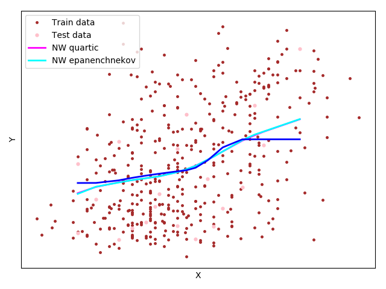

Задачу обучения по прецедентам  принято называть *восстановлением регрессии*. Постановка задачи аналогична. 

Модель алгоритмов задана в виде парам-кого семейства функций , а  - вектор параметров.


Функционал качества аппроксимации целевой зависимости на выборке - сумма квадратов ошибок - *остаточная сумма квадратов, RSS*: 


, где  - вес, важность объекта i. 


Обучение по методу наименьших квадратов - поиск вектора параметров , где достигается минимум среднего квадрата ошибки на выборке: 


Решение оптимизационной задачи - использование необходимого условия минимума. Оно же и принимается за искомый вектор .

## Непараметрическая регрессия. Ядерное сглаживание.

Непараметрическое восстановление регрессии основано на той же идее, непараметрическое восстановление плотности распределения.


Значение *a(x)* вычисляется для каждого объекта по нескольким ближайшим к нему объектам выборки. Для оценки близости на множестве должна быть задана функция расстояния 

## Формула Надарая–Ватсона

Для вычисления значения , воспользуемся МНК: 


Зададим веса, убывающие по мере увеличения расстояния. Для этого введём невозрастающую, гладкую, ограниченную
функцию  - ядро: 


*h* - ширина ядра/окна сглаживания. Чем меньше *h*, тем быстрее будут убывать веса ) по мере удаления *xi* от *x*

Приравняв нулю производную  получим формулу ядерного сглаживания Надарая–Ватсона:


,т.е, значение есть среднее  по объектам , ближайшим к 

#### Реализация

Был взят датасет *[diabetes](https://scikit-learn.org/stable/modules/generated/sklearn.datasets.load_diabetes.html#sklearn.datasets.load_diabetes)* из *scikit-learn**

Подбор параметра *h* происходит с помощью LOO(leave-one-out) CV. 
Для решения задачи был реализован класс Regression, содержащий необходимый функционал.

метод для конечного обучения модели (поиск минимальной ширины окна)
```python
        h = prec
        # if self._ident is 0:
        curr_loo = self.__loo(x, y, h)
        min_loo = curr_loo
        min_h = h
        while curr_loo > prec and h > step:
            h -= step
            print(h)
            curr_loo = self.__loo(x, y, h)
            if min_loo > curr_loo:
                min_loo = curr_loo
                min_h = h
        self._h = min_h
        self._x = x
        self._y = y
```
метод **kern_smooth** для подсчёта исходной формулы на итерации.
```python
            for xi, yi in zip(x, y):
                dist = dist(cur_x, xi)
                ker_v = ker(dist / h)
                denor += ker_v
                numer += yi * ker_v
        if denor > 0:
            res = numer / denor
        return res
```
Пресловутый LOO CV
```python
        res = 0
        count = 1
        for xi, yi in zip(x, y):
            new_x = np.delete(x, xi)
            new_y = np.delete(y, yi)
            smooth = self.__kern_smooth(xi, new_x, new_y, self._kernel, self._dist, h)
            val = (smooth - yi) ** 2
            res += val
            count += 1
```
Были применены квартическое ядро и ядро Епанечникова. (Ядро почти не влияет на результат, разница между ними минимальна). Стартовые параметры: *precision=0.007, step=0.04, featr=3, n=20*


| h_min  |  method | core          | SSE     |
|-------|---------|---------------|---------|
|  0.019(9)     | NW      | quartic       | 6714.07 |
|   0.03    | NW      | epanenchnekov | 6737.99 |


