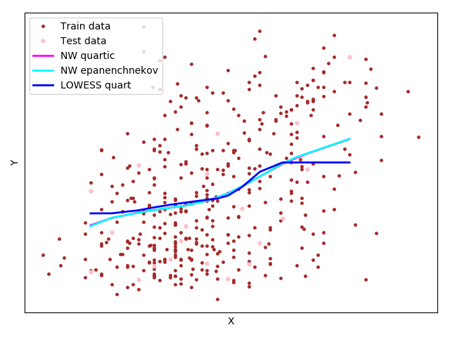

# Восстановление регрессии
Задачу обучения по прецедентам  принято называть *восстановлением регрессии*. Постановка задачи аналогична. 

Модель алгоритмов задана в виде парам-кого семейства функций , а  - вектор параметров.


Функционал качества аппроксимации целевой зависимости на выборке - сумма квадратов ошибок - *остаточная сумма квадратов, RSS*: 


, где  - вес, важность объекта i. 


Обучение по методу наименьших квадратов - поиск вектора параметров , где достигается минимум среднего квадрата ошибки на выборке: 


Решение оптимизационной задачи - использование необходимого условия минимума. Если функция  достаточное число раз дифференцируема по , то в точке минимума выполняется система *p* уравнений относительно *p* неизвестных:


Решение же и принимается за искомый вектор .

## Непараметрическая регрессия. Ядерное сглаживание.

Непараметрическое восстановление регрессии основано на той же идее, непараметрическое восстановление плотности распределения.


Значение *a(x)* вычисляется для каждого объекта по нескольким ближайшим к нему объектам выборки. Для оценки близости на множестве должна быть задана функция расстояния 

## Формула Надарая–Ватсона

Для вычисления значения , воспользуемся МНК: 


Зададим веса, убывающие по мере увеличения расстояния. Для этого введём невозрастающую, гладкую, ограниченную
функцию  - ядро: 


*h* - ширина ядра/окна сглаживания. Чем меньше *h*, тем быстрее будут убывать веса ) по мере удаления *xi* от *x*

Приравняв нулю производную  получим формулу ядерного сглаживания Надарая–Ватсона:


,т.е, значение есть среднее  по объектам , ближайшим к 

#### Реализация

Был взят датасет *[diabetes](https://scikit-learn.org/stable/modules/generated/sklearn.datasets.load_diabetes.html#sklearn.datasets.load_diabetes)* из *scikit-learn**

Подбор параметра *h* происходит с помощью LOO(leave-one-out) CV. 
Для решения задачи был реализован класс Regression, содержащий необходимый функционал.

метод для конечного обучения модели (поиск минимальной ширины окна)
```python
        h = prec
        # if self._ident is 0:
        curr_loo = self.__loo(x, y, h)
        min_loo = curr_loo
        min_h = h
        while curr_loo > prec and h > step:
            h -= step
            print(h)
            curr_loo = self.__loo(x, y, h)
            if min_loo > curr_loo:
                min_loo = curr_loo
                min_h = h
        self._h = min_h
        self._x = x
        self._y = y
```
метод **kern_smooth** для подсчёта исходной формулы на итерации.
```python
            for xi, yi in zip(x, y):
                dist = dist(cur_x, xi)
                ker_v = ker(dist / h)
                denor += ker_v
                numer += yi * ker_v
        if denor > 0:
            res = numer / denor
        return res
```
Пресловутый LOO CV
```python
        res = 0
        count = 1
        for xi, yi in zip(x, y):
            new_x = np.delete(x, xi)
            new_y = np.delete(y, yi)
            smooth = self.__kern_smooth(xi, new_x, new_y, self._kernel, self._dist, h)
            val = (smooth - yi) ** 2
            res += val
            count += 1
```
Были применены квартическое ядро и ядро Епанечникова. (Ядро почти не влияет на результат, разница между ними минимальна). Стартовые параметры: *precision=0.007, step=0.04, featr=3, n=20*

###  LOWESS (locally weighted scatterplot smoothing)

NW - оценка очень чувствительна к одиночным выбросам. Т.е, чем больше величина ошибки 


тем в большей степени объект является выбросом, и тем меньге должен быть его вес. Домножаем веса ) на коэффициенты 

#### Алгоритм LOWESS:
обучающая выборка 

Выход:

коэффициенты 

1. инициализация: 
2. повторять
3. вычислить оценки скользящего контроля на каждом объекте: 
4. вычислить коэффициенты  :

5. Пока коэффициенты не стабилизируются. 

#### Реализация

Различия с NW методом заключаются в дополнительном учёте новых коэффициентов .

| hopt  |  method | core          | SSE     |
|-------|---------|---------------|---------|
|  0.019(9)     | NW      | quartic       | 6714.07 |
|   0.03    | NW      | epanenchnekov | 6737.99 |
|   0.05   | LOWESS     | quartic | 6152.48 |





## Многомерная линейная регрессия
Имеется набор *n* вещественных признаков 
. Решение системы  


существенно упрощается, если модель алгоритмов линейна по :


Вводятся матричные обозначения: матрицу информации *F* , целевой вектор *y*, вектор параметров *α* и диагональную матрицу весов *W* :


В матричных обозначениях функционал среднего квадрата ошибки принимает вид 


### Нормальная система уравнений
Необходимое условие минимума в матричном виде:
 


Эта система линейных уравнений относительно α называется нормальной системой
для задачи наименьших квадратов. Матрица  имеет размер **n × n** и совпада-
ет с ковариационной матрицей набора признаков 

### SVD. Линейная регрессия

Если число признаков не превышает число объектов,  и среди столбцов **F** нет л.з., то **F** можно представить сингулярным разложением (singular value decomposition): 


свойства:
1. **l × n** матрица **V** ортогональна,  , и составлена из **n** собственных векторов матрицы , соответствующих ненулевым собственным значениям;
2. **n × n** матрица **U** ортогональна,  , и составлена из собственных векторов матрицы  ;
3. **n × n** матрица **D** диагональна, ,  - собственные значения матриц 

Имея сингулярное разложение,получаем решение задачи наименьших квадратов в явном виде, не прибегая к трудоёмкому обращению матриц:  

Вектор МНК- решения и МНК- аппроксимация *y* соответственно:


#### Реализация
Был использован датасет [boston](https://scikit-learn.org/stable/modules/generated/sklearn.datasets.load_boston.html#sklearn.datasets.load_boston) из всё того же scikit-learn
Реализуем решение нормальной системы:
```python
def linear_regression(x_train, y_train, x_test):
    X = np.array(x_train)
    ones = np.ones(len(X))
    X = np.column_stack((ones, X))
    y = np.array(y_train)

    Xt = transpose(X)
    product = dot(Xt, X)
    theInverse = inv(product)
    w = dot(dot(theInverse, Xt), y)

    predictions = []
    x_test = np.array(x_test)
    for i in x_test:
        components = w[1:] * i
        predictions.append(sum(components) + w[0])
    predictions = np.asarray(predictions)
    return predictions
```
строим матрицы ошибок и график значений одного признака (он имеет наибольшую величину корреляции) для визуализации распределения (для подтверждения соответствия после применения SVD)

после получения первой функции, применяем к тем же данным SVD:
```python
    A = f_plot.values

    temp = A.T.dot(A)
    S, V = np.linalg.eig(temp)
    S = np.diag(np.sqrt(S))

    U = A.dot(V).dot(np.linalg.inv(S))
    reconstructed_2 = U.dot(S).dot(V.T)
    df_2 = pd.DataFrame(reconstructed_2, columns=f_plot.columns)
    
    train_2 = df_2[:train_size]
    test_2 = df_2[train_size:]

    x_train_2 = train_2.drop('Target', axis=1)
    y_train_2 = train_2['Target']

    x_test_2 = test_2.drop('Target', axis=1)
    y_test_2 = test_2['Target']

    res_2 = linear_regression(x_train_2, y_train_2, x_test_2)
```

Результаты:


| method | SSE |
|--------------|---------|
| SVD linreg     | 3553.86033953874|
| casual linreg |8654.375722902236 |


### Проблема мультиколлинеарности
Если ковариационная матрица  имеет неполный ранг, то её обращение невозможно. 

Часто встречается случай мультиколлинеарности, **Σ** имеет полный ранг, но близка к некоторой матрице неполного ранга.

Тогда **Σ** — матрица неполного псевдоранга,и плохо обусловлена. Столбцы почти линейно зависимы, условие л.з выполняется приближённо. Аналогично для **F** .

Геометрически - что объекты выборки сосредоточены около линейного подпространства меньшей размерности ***m < n***. 
Признаком мультиколлинеарности является наличие у матрицы **Σ** собственных значений, близких к нулю.

Число обусловленности **Σ**:


(шутки ради, TeX - код этой формулы
\mu(\sum) = \left \| \sum \right \|\left \| \sum^{-1} \right \| = \frac{\max_{u: \left \| u \right \|= 1} \left \| \sum u \right \| }{\min_{u: \left \| u \right \|= 1} \left \| \sum u \right \| } = \frac{\lambda_{\max}}{\lambda_{\min}} )

где  - максимальное и минимальное собственные значения матрицы **Σ**, все нормы евклидовы.

### Ridge Regression

Для решения проблемы мультиколлинеарности припишем к функционалу **Q** дополнительное слагаемое, штрафующее большие значения нормы вектора весов : 


где  неотрицательный параметр. 

В случае мультиколлинеарности имеется бесконечно много векторов **α**, доставляющих функционалу Q значения, близкие к минимальному. 

Штрафное слагаемое - регуляризатор, благодаря которому выбирается решение с минимальной нормой. 

Приравнивая нулю производную  по параметру **α**, находим:


Перед обращением матрицы к ней добавляется «гребень» — диагональная матрица .

Добавление гребня к матрице  увеличивает все её собственные значения на **τ** , но не изменяет cобственных векторов. 

Матрица становится хорошо обусловленной, оставаясь в то же время «похожей» на исходную.

Регуляризованная МНК - аппроксимация через SVD вектора *y*: 


МНК-аппроксимация - разложение **y** по базису собственных векторов .

Проекции на собственные векторы сокращаются, уменьшается и норма вектора коэффициентов.

Отсюда ещё одно название метода — сжатие (shrinkage) или сокращение весов (weight decay)
По мере увеличения **τ**  становится более устойчивым/ понижение эффективной размерности решения.

При использовании регуляризации эффективная размерность принимает значение от 0 до n, не обязательно целое, и убывает при возрастании **τ** : 


Подбирать  **τ**  можно по CV, но это слишком долгая процедура. На практике  **τ** - в диапазоне (0.1, 0.4)

### Реализация
```python
def solve_ridge_regression(X, y):
    wRR_list = []
    df_list = []
    for i in range(0, 5001, 1):
        lam_par = i
        xtranspose = np.transpose(X)
        xtransx = np.dot(xtranspose, X)
        if xtransx.shape[0] != xtransx.shape[1]:
            raise ValueError('Needs to be a square matrix for inverse')
        lamidentity = np.identity(xtransx.shape[0]) * lam_par
        matinv = np.linalg.inv(lamidentity + xtransx)
        xtransy = np.dot(xtranspose, y)
        wRR = np.dot(matinv, xtransy)
        _, S, _ = np.linalg.svd(X)
        df = np.sum(np.square(S) / (np.square(S) + lam_par))
        wRR_list.append(wRR)
        df_list.append(df)
    return wRR_list, df_list
```
```python
def getRMSEValues(X_test, y_test, wRRArray, max_lamda, poly):
    RMSE_list = []
    for lamda in range(0, max_lamda+1):
        wRRvals = wRRArray[lamda]
        y_pred = np.dot(X_test, wRRvals)
        RMSE = np.sqrt(np.sum(np.square(y_test - y_pred))/len(y_test))
        RMSE_list.append(RMSE)
    plotRMSEValue(max_lamda, RMSE_list, poly=poly)
```

## Результаты


Из решения мы знаем, что когда df (λ) является максимальным значением, это соответствует λ, равному 0, что является решением наименьших квадратов. 
Шестой признак  и чётвёртый имеют наибольшую величину, что указывает на то, что они являются наиболее важными характеристиками при определении стоимости недвижимости на этих данных.

Таким образом, мы можем сказать, что для решения наименьших квадратов признаки 4 и 6 являются наиболее важными, которые влияют на решение, но поскольку мы всегда стараемся упорядочить веса, чтобы они были маленькими, их веса получают наибольшее штраф, если включить гиперпараметр (λ) для ridgereg и изменить его

Поскольку λ всегда больше 0, увеличение значений λ приводит к уменьшению степеней свободы и регуляризованных весов для всех ковариат в нашем решении.
